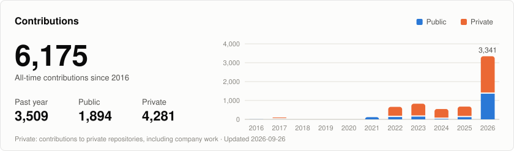
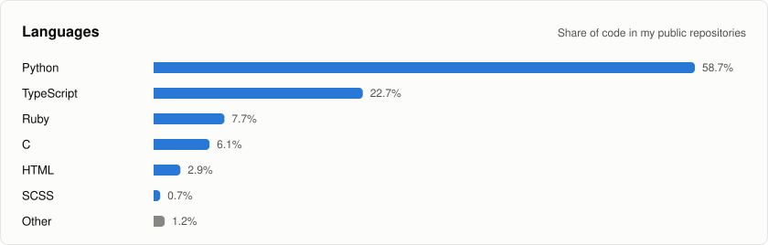

## I'm E.J. Lin 

<a href="https://github.com/DenverCoder1/readme-typing-svg">
  <picture>
    <source media="(prefers-color-scheme: dark)" srcset="https://readme-typing-svg.demolab.com?font=Libre+Barcode+39+Text&size=70&duration=2000&pause=3000&color=E6EDF3&width=615&lines=Back+End+Developer">
    
  </picture>
</a>

## GitHub Stats

<picture>
  <source media="(prefers-color-scheme: dark)" srcset="profile/contributions-dark.svg">
  
</picture>

<picture>
  <source media="(prefers-color-scheme: dark)" srcset="profile/languages-dark.svg">
  
</picture>
